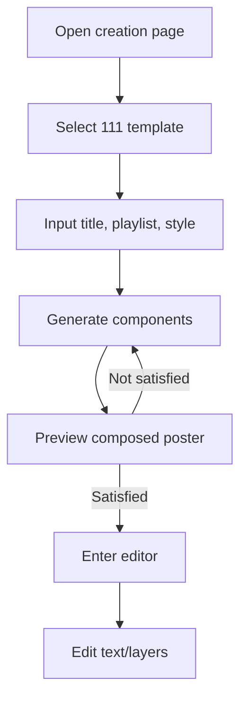
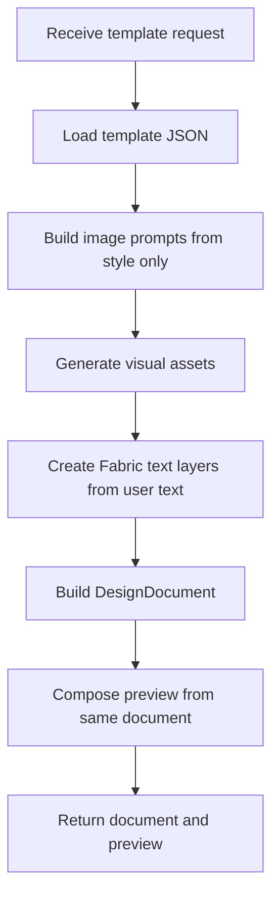

# PRD: 模板组合式海报生成

## 0. Review Conclusion
| Item | Conclusion |
|---|---|
| Version goal | 用固定模板组合替代“AI 生成整图再拆分”，先完成 111 歌单海报模板的可用闭环。 |
| This version does | 用户输入标题、歌单、风格；系统按固定槽位生成组件素材，叠加可编辑文本层，生成预览并进入编辑器。 |
| This version does not do | 不做全图自由生成、不做动态 mask 拆分、不做 OCR 回收、不做多模板市场、不保证 AI 组件完全无文字。 |
| Biggest decision needed | player / playlist 的背板是否允许 image2 生成；若实测仍有随机文字，是否直接改为 Fabric 矢量背板。 |
| Biggest risk | 独立生成组件的风格一致性和 image2 在 UI 组件中自动生成随机文字。 |

## 1. Background and Problem
旧方案是 image2 先生成完整海报，再通过动态 mask 拆出人物、标题、播放器、歌单和背景。实测后发现组件拆分质量不稳定：文字混入错误组件、人物边缘不准、播放器/歌单边框残留，进一步影响背景补全。新方案改为固定模板组合：模板先定义槽位和文字区域，AI 只生成视觉素材，文字由 Fabric 文本层渲染，从源头减少拆分和文字不可编辑问题。

## 2. Goals and Non-goals

### Goals
| Goal | Success meaning |
|---|---|
| 版式可控 | 111 模板的背景、女孩、标题、播放器、歌单位置固定，不由 image2 决定布局。 |
| 文字可编辑 | 用户输入的标题、歌单、播放器歌名不进入 image2 prompt，只作为 Fabric 文本层。 |
| 预览和编辑一致 | 创作页预览和编辑器使用同一个 DesignDocument，不维护两套拼接逻辑。 |
| 可重复生成 | 用户可重新生成整体结果；后续支持按 slot 增量重生成。 |
| 分支隔离 | 保留旧动态 mask 分支/主线，不继续在旧方案上追加改动；新方案在 `template-composition` 分支维护。 |

### Non-goals
| Non-goal | Reason |
|---|---|
| 任意模板自动生成 | 当前只验证 111 歌单海报模板，避免模板系统过早泛化。 |
| AI 生成完整海报 | 这是旧方案的核心不稳定来源。 |
| 动态 mask / 背景补全主路径 | 新方案不依赖拆分后补洞。 |
| 文字 OCR | 当前文字由用户输入，不需要从生成图中识别。 |
| 透明人物抠图 | MVP 先使用矩形女孩插画 slot；透明人物可作为后续版本。 |

## 3. Scope
| Scope item | Included? | Notes |
|---|---:|---|
| 111 歌单海报模板 JSON | Yes | 包含 canvas 和所有固定 slot。 |
| 模板缩略图 | Yes | 创作页展示矩形布局，帮助用户理解模板。 |
| 用户输入标题 | Yes | 不传给 image2，只渲染为文本层。 |
| 用户输入歌单 | Yes | 不传给 image2，只渲染为文本层。 |
| 用户输入风格 | Yes | 传给 image2，作为所有视觉组件共享 style brief。 |
| 生成背景素材 | Yes | image2 生成，prompt 明确 no text / no labels。 |
| 生成女孩素材 | Yes | image2 生成矩形插画，prompt 明确 portrait / no text。 |
| 生成播放器背板 | Conditional | 先用 image2 生成 skin；若随机文字不可控，改 Fabric 矢量。 |
| 生成歌单背板 | Conditional | 先用 image2 生成 skin；若随机文字不可控，改 Fabric 矢量。 |
| 文本层进入编辑器 | Yes | 标题、歌名、歌单文字必须可编辑。 |
| 按 slot 增量重生成 | Partial | 后端接口需支持资产复用和指定 slot 重生；前端按钮可后续补。 |

## 4. Roles and Permissions
| Role | View | Operate | Restrictions |
|---|---|---|---|
| 普通用户 | 创作页、预览页、编辑页 | 输入标题/歌单/风格，生成、重生成、确认进入编辑 | 不能修改模板结构和 slot 坐标。 |
| 设计师用户 | 同普通用户，后续可扩展模板管理 | 当前版本不额外开放 | 模板管理不在本版本。 |
| 开发/运营 | 查看生成结果、日志和失败信息 | 可调整固定模板代码和 prompt | 没有后台配置页。 |

## 5. Core Rules
| Rule ID | Trigger | Condition | Result | User-facing behavior |
|---|---|---|---|---|
| R1 | 用户进入 AI 创作页 | 当前为模板组合版本 | 显示 111 模板缩略图和输入表单 | 用户看到固定布局，而不是自由 prompt 页面。 |
| R2 | 用户提交生成 | 标题、歌单、风格已填写或使用默认值 | 创建 template run | 页面显示生成中状态。 |
| R3 | 调用 image2 生成组件 | 生成背景/女孩/player skin/playlist skin | prompt 只包含风格和组件视觉描述 | 用户文字不进入 image2。 |
| R4 | 生成文字层 | 用户输入标题/歌单/播放器歌名 | 创建 Fabric text components | 编辑器中可选择和修改文字。 |
| R5 | 生成预览 | 组件素材和文本层已生成 | 用同一个 DesignDocument 合成预览 | 预览和进入编辑后的布局一致。 |
| R6 | 用户不满意 | 点击重新生成 | MVP 可全量重跑；后续可指定 slot | 用户获得新预览。 |
| R7 | 用户确认 | 预览可接受 | 进入编辑器并加载同一 DesignDocument | 图层可选中、拖动、隐藏、编辑文字。 |
| R8 | player/playlist skin 含随机文字 | 实测发现 image2 无法遵守 no text | 改用 Fabric 矢量背板 | 不再让 AI 生成 UI 背板文字区域。 |
| R9 | API 失败 | 任一视觉组件生成失败 | 使用占位背板或返回错误，需明确标识 provider/fallback | 用户不应误以为是最终 AI 成品。 |

## 6. Flow Summary

### User Flow


### System Judgment Flow


### UI Layout Sketch
```text
Creation Page
┌────────────────────────────┐
│ Template: 111 playlist     │
│ ┌──── preview rectangles ─┐ │
│ │ title                   │ │
│ │ girl | player           │ │
│ │      | playlist         │ │
│ └─────────────────────────┘ │
│ Title input                 │
│ Playlist textarea           │
│ Style textarea              │
│ [Generate]                  │
└────────────────────────────┘

Poster Template 390x600
┌────────────────────────────┐
│            title           │
│ girl area     player card  │
│ girl area     playlist box │
│ girl area                  │
│ bottom decor in background │
└────────────────────────────┘
```

### Key Exceptions
| Exception | Handling |
|---|---|
| image2 在 player/playlist 背板生成文字 | 降级为 Fabric 矢量背板，AI 只生成背景和女孩。 |
| 中文预览乱码 | 预览合成必须使用 CJK 字体 fallback；否则不允许进入部署验收。 |
| 歌单过长 | 当前最多显示模板可容纳的条目；后续支持分页或自动缩字号。 |
| 组件风格不一致 | 所有组件共享同一 style brief；若仍明显割裂，需减少 AI 组件数量。 |
| API 慢或失败 | 给出 loading 和错误，不静默降级成看似成功的结果。 |

## 7. Page and Interaction Requirements
| Page / component | Required content | Actions | States |
|---|---|---|---|
| 创作页 header | 返回、标题“模板创作” | 返回上一页 | 默认 |
| 模板缩略图 | 111 模板矩形示意 | 选择模板 | selected |
| 标题输入 | 默认标题，可编辑 | 输入/清空 | normal/focus |
| 歌单输入 | 默认歌曲，多行输入 | 输入/粘贴 | normal/focus |
| 风格输入 | 默认 pastel pink style | 输入/修改 | normal/focus |
| 生成按钮 | 生成模板海报 | 调用 generate-template | idle/loading/disabled |
| 预览区 | 展示合成图 | 重新生成、确认进入编辑 | success/loading/error |
| 编辑器 | 背景、女孩、player、playlist、文本层 | 移动/缩放/隐藏/编辑文字 | selected/unselected/hidden |

## 8. Admin and Operations Requirements
| Requirement | Must-have? | Notes |
|---|---:|---|
| 后台模板管理 | No | 当前模板 JSON 写死在代码，先不做后台。 |
| provider key 配置 | Yes | 继续使用现有环境变量，不在 PRD 中扩展后台。 |
| 模板版本记录 | Yes | DesignDocument meta 需记录 template id / run id / assets。 |
| 生成失败日志 | Yes | 需要定位 image2 是否乱写文字、失败或 fallback。 |
| 成本控制面板 | No | MVP 不做，但需要记录每次生成的组件数和耗时。 |

## 9. Data and Acceptance

### Metrics
| Metric | Definition | Why needed |
|---|---|---|
| template_generate_success_rate | generate-template 成功返回 DesignDocument 的比例 | 判断模板链路是否可用。 |
| average_generate_seconds | 从点击生成到返回预览的平均时长 | 判断用户是否能接受等待。 |
| ai_asset_text_violation_rate | player/playlist/background/girl 生成图中出现随机文字的比例 | 决定是否降级为 Fabric 背板。 |
| editor_entry_rate | 预览后点击确认进入编辑器的比例 | 判断预览是否满足用户。 |
| regeneration_rate | 用户点击重新生成的次数 / 生成次数 | 判断组件质量和风格一致性。 |

### Acceptance Criteria
| Case | Precondition | Action | Expected result |
|---|---|---|---|
| A1 模板入口 | 用户进入 AI 创作 | 打开页面 | 只展示 111 模板缩略图和输入表单。 |
| A2 用户文字不进 image2 | 用户输入自定义标题和歌曲 | 点击生成 | 后端 image2 prompt 中不包含用户标题、歌名、介绍文字。 |
| A3 DesignDocument 可编辑 | 生成成功 | 点击确认进入编辑 | 标题、歌单、播放器歌名是 text component，可在编辑器中修改。 |
| A4 预览一致 | 生成成功 | 对比预览和编辑器初始画面 | 布局和主要内容一致，不出现两套拼接差异。 |
| A5 模板坐标唯一源 | 修改模板 JSON slot 坐标 | 重新生成 | 前端缩略图和后端组件布局使用同一套 slot 定义。 |
| A6 中文预览 | 标题和歌单含中文 | 生成预览 | 中文可读，不显示方块或乱码。 |
| A7 no text 约束 | 生成 player/playlist skin | 检查图片组件 | 不应出现随机英文/中文/数字；如出现，记录为 text violation。 |
| A8 fallback | image2 失败 | 生成模板 | 返回明确错误或标识 fallback，占位图不能伪装成最终成品。 |
| A9 重生成 | 用户不满意 | 点击重新生成 | 至少能全量重跑；后续 slot 级重生成不影响未选 slot。 |

## 10. Risks and Decisions
| Type | Item | Owner | Status |
|---|---|---|---|
| Decision needed | player/playlist 是否继续由 image2 生成背板，还是直接 Fabric 矢量化 | @ColaK1ller | 待审核 |
| Decision needed | 女孩 MVP 是否接受矩形插画，不做透明抠图 | @ColaK1ller | 待审核 |
| Risk | image2 自动生成随机文字 | @Codex | 需实测并准备 Fabric fallback |
| Risk | 独立组件视觉不统一 | @Codex | 用统一 style brief 缓解 |
| Risk | 预览中文字体缺失 | @Codex | 必须修复后再部署 |
| Risk | 390x600 固定模板无法容纳长歌单 | @Mimo / @ColaK1ller | 需确认截断/缩字规则 |
| Risk | 当前分支已有实现先于 PRD | @Codex | PRD 审核后再决定保留或回滚实现细节 |

## Appendix: Deferred Items
| Item | Reason deferred | Revisit trigger |
|---|---|---|
| 多模板 | 先验证 111 模板闭环 | 111 模板验收稳定后 |
| 模板后台配置 | 当前硬编码成本低 | 模板数量超过 3 个或运营需要编辑 |
| 透明人物图层 | 需要抠图/透明输出能力 | 矩形人物影响视觉效果时 |
| OCR 文字回收 | 新流程文字来自用户输入 | 需要导入已有海报时 |
| 专业分割模型 | 新流程不再依赖拆整图 | 需要从非模板图片拆组件时 |
| slot 级前端重生成按钮 | 后端先支持参数即可 | 用户需要只换女孩/背景时 |

