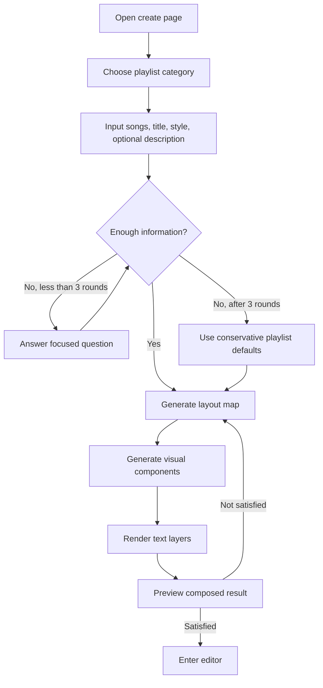
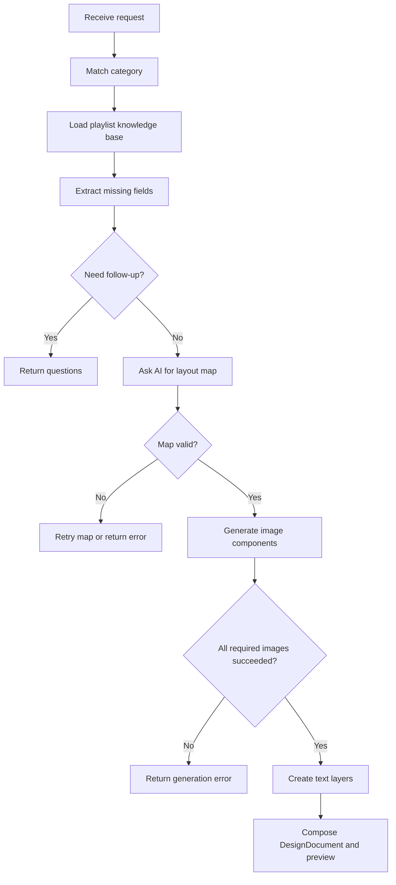

# PRD: 分类驱动的组件化素材生成

## 0. Review Conclusion
| Item | Conclusion |
|---|---|
| Version goal | 先完成“歌单”分类 demo：用户输入素材分类、文字内容和风格，系统追问补全信息后生成 layout map，再按 map 生成组件并组装成可编辑设计。 |
| This version does | 支持歌单分类；最多 3 轮追问；AI 生成 layout map；image gen 生成视觉组件；真实文本层按 map 渲染；输出 DesignDocument。 |
| This version does not do | 不固定 111 模板；不让 image2 生成完整海报；不做 Fabric 图形 fallback；不把用户文字发给 image gen；不做多分类正式上线。 |
| Biggest decision needed | demo 的追问策略是否由前端多轮交互实现，还是后端一次性返回缺失问题后再提交。 |
| Biggest risk | layout map 是 AI 生成的文本规则，不是硬约束；需要严格校验 map 字段完整性和组件生成结果。 |

## 1. Background and Problem
旧路径“整图生成 -> 动态 mask 拆分 -> 背景补全”无法稳定满足设计软件要求：拆分边界、文字归属和背景填充会相互放大错误。固定 111 模板方案又过窄，做出来不是实际要上线的产品。新的目标是分类驱动：用户先说明要生成的素材分类，例如歌单、头像、资料卡，并提供风格和文字信息；系统在信息不足时追问；随后参考分类知识库生成布局 map，按 map 分别生成视觉组件和文本层，最后组装成可编辑设计。

当前 demo 只做“歌单”分类，知识库路径为：
`docs/prd-workspace/template-composition/playlist-category-context.md`

## 2. Goals and Non-goals

### Goals
| Goal | Success meaning |
|---|---|
| 分类驱动 | 用户先选择或输入素材分类；demo 中只保留“歌单”。 |
| 信息补全 | 用户描述不足时，系统最多追问 3 轮，直到能生成 layout map。 |
| 动态布局 | AI 根据分类知识库、用户风格和内容生成 layout map，而不是使用固定模板坐标。 |
| 组件化生成 | image gen 只生成 map 中的视觉组件，并为文字区域留白。 |
| 真实文本层 | 用户文字只进入文本层，文本层包含颜色、字号、字体、间距、行距、旋转等属性。 |
| 可编辑输出 | 最终输出 DesignDocument，编辑器可调整组件和文本。 |

### Non-goals
| Non-goal | Reason |
|---|---|
| 固定 111 模板 | 与真实上线方向不一致。 |
| Fabric fallback | 设计软件不能用矢量占位或假背板伪装生成结果。 |
| image2 生成用户文字 | 会导致文字不可编辑、失真和混入图片。 |
| 任意分类完整上线 | demo 先只验证歌单分类。 |
| 专业分割 / 动态 mask | 新路径不从整图拆分。 |

## 3. Scope
| Scope item | Included? | Notes |
|---|---:|---|
| 分类输入 | Yes | demo 只保留歌单一种分类，其他分类先不展示。 |
| 歌单分类知识库 | Yes | 用 MD 描述歌单常见元素、布局、风格、文本规律。 |
| 追问机制 | Yes | 信息不足时最多追问 3 轮。 |
| layout map 生成 | Yes | AI 生成每个组件的位置、尺寸、层级、生成说明和文本区域样式。 |
| map 校验 | Yes | 后端必须校验字段完整、尺寸合法、组件不越界。 |
| 视觉组件生成 | Yes | image gen 按 map 的 component prompt 逐个生成。 |
| 文本层渲染 | Yes | 用户标题、歌曲列表、描述等作为真实文本层。 |
| 组装预览 | Yes | 按 map 合成预览，并返回同一份 DesignDocument。 |
| slot 级重生成 | Later | 当前先做全量生成闭环。 |
| 多分类 | Later | 头像、资料卡后续再加。 |

## 4. Roles and Permissions
| Role | View | Operate | Restrictions |
|---|---|---|---|
| 普通用户 | 创作页、追问页、预览页、编辑页 | 输入分类、风格、标题、歌单、描述；回答追问；生成/重生成/确认 | 不能手动编辑 layout map JSON。 |
| 设计师用户 | 同普通用户 | 当前不开放额外模板管理 | 多分类和模板管理不在 demo。 |
| 系统 | 分类匹配、追问、map 生成、组件生成、组装 | 校验 map 并输出 DesignDocument | 不得把用户文字传给 image gen。 |

## 5. Core Rules
| Rule ID | Trigger | Condition | Result | User-facing behavior |
|---|---|---|---|---|
| R1 | 用户进入创作 | demo 阶段 | 只展示“歌单”分类 | 用户不需要在多个未完成分类中选择。 |
| R2 | 用户提交初始描述 | 分类=歌单 | 系统检查标题、歌曲列表、风格、用途等是否足够 | 不足则进入追问。 |
| R3 | 信息不足 | 未达到生成 map 的最低信息 | 最多追问 3 轮 | 每轮只问影响布局或风格的关键问题。 |
| R4 | 3 轮后仍不足 | 用户未补全信息 | 使用歌单知识库中的保守默认：标题 + 歌曲列表 + 背景/装饰 | 不继续无限追问。 |
| R5 | 生成 layout map | 信息足够 | AI 参考歌单知识库输出 map | map 包含组件和文本层完整属性。 |
| R6 | 校验 layout map | map 返回后 | 后端检查 canvas、组件、文本层字段 | 不合格则要求重生 map 或返回错误。 |
| R7 | 生成视觉组件 | map 通过校验 | image gen 只接收风格、组件描述、留白要求 | 不包含用户标题、歌名、文案。 |
| R8 | 渲染文本层 | map 中存在 text area | 使用用户文字和 map 样式创建文本层 | 字体、字号、颜色、字距、行距、旋转等可编辑。 |
| R9 | 组装输出 | 组件和文本层生成完成 | 按 map 合成预览和 DesignDocument | 用户可预览并进入编辑器。 |
| R10 | 生成失败 | image gen 或 map 失败 | 返回失败原因，不使用 Fabric fallback 假装成功 | 用户看到明确错误或重新生成入口。 |

## 6. Flow Summary

### User Flow


### System Judgment Flow


### Layout Map Required Shape
```json
{
  "category": "playlist",
  "canvas": {"width": 390, "height": 600, "background": "#..."},
  "layoutPattern": "title-visual-list | split | floating-card | collage",
  "components": [
    {
      "id": "background",
      "type": "image",
      "x": 0,
      "y": 0,
      "width": 390,
      "height": 600,
      "zIndex": 0,
      "prompt": "visual description, no text, leave readable areas"
    }
  ],
  "textLayers": [
    {
      "id": "playlist-title",
      "role": "title",
      "contentSource": "user.title",
      "x": 24,
      "y": 32,
      "width": 342,
      "height": 48,
      "zIndex": 50,
      "style": {
        "fontFamily": "system",
        "fontSize": 30,
        "fontWeight": "bold",
        "color": "#ffffff",
        "textAlign": "center",
        "letterSpacing": 0,
        "lineHeight": 1.1,
        "rotation": 0,
        "opacity": 1,
        "stroke": "#ff7ab8",
        "strokeWidth": 2,
        "shadow": "0 2px 8px rgba(0,0,0,0.25)"
      }
    }
  ]
}
```

### Key Exceptions
| Exception | Handling |
|---|---|
| 用户只说“做个好看的歌单” | 追问歌曲数量/主题风格/用途；最多 3 轮。 |
| 用户没有给歌名 | 不能生成最终成品；返回必须输入歌单内容，除非用户明确只要占位演示。 |
| layout map 越界或字段缺失 | 拒绝进入组件生成，要求 map 重生或返回错误。 |
| image gen 生成组件失败 | 返回错误，不使用 Fabric fallback。 |
| image gen 在空白区域生成文字 | 该组件判定失败，需重生；不能接受为合格结果。 |
| 歌曲列表太长 | map 需选择多列、缩字号或截断规则；必须明确显示规则。 |

## 7. Page and Interaction Requirements
| Page / component | Required content | Actions | States |
|---|---|---|---|
| 分类选择 | demo 只展示歌单 | 选择歌单 | selected |
| 初始输入页 | 标题、歌单、风格、补充描述 | 输入、提交 | normal/loading/error |
| 追问页 | 最多 3 轮问题 | 回答、跳过（使用默认） | round 1/2/3 |
| 生成进度 | 当前阶段：map / components / compose | 等待、取消 | loading/error |
| 预览页 | 按 map 组装后的成品 | 重生成、确认进入编辑 | success/error |
| 编辑页 | 视觉组件和真实文本层 | 移动、缩放、编辑文本、隐藏 | selected/unselected/hidden |

## 8. Admin and Operations Requirements
| Requirement | Must-have? | Notes |
|---|---:|---|
| 分类知识库文件 | Yes | demo 必须读取歌单分类 MD。 |
| provider key 配置 | Yes | 沿用现有环境变量。 |
| map 生成日志 | Yes | 记录 prompt、知识库版本、map、校验结果。 |
| 组件生成日志 | Yes | 记录每个组件 prompt、耗时、成功/失败原因。 |
| 后台管理页面 | No | demo 不做。 |
| 成本控制 | Later | 先记录调用次数和耗时，不做后台控制。 |

## 9. Data and Acceptance

### Metrics
| Metric | Definition | Why needed |
|---|---|---|
| followup_round_count | 每次生成前实际追问轮数 | 判断输入门槛是否合理。 |
| map_valid_rate | layout map 首次通过校验比例 | 判断 map prompt 和知识库质量。 |
| component_success_rate | image gen 组件成功数 / 必需组件数 | 判断组件生成可用性。 |
| text_violation_rate | 视觉组件中出现可读用户文字或随机文字的比例 | 判断 no text 约束是否稳定。 |
| preview_accept_rate | 用户确认进入编辑 / 预览次数 | 判断成品是否接近预期。 |
| average_generation_time | 从提交到预览成功的平均时长 | 判断等待是否可接受。 |

### Acceptance Criteria
| Case | Precondition | Action | Expected result |
|---|---|---|---|
| A1 分类 demo | 用户进入创作页 | 查看分类 | 只出现歌单分类，或歌单为唯一可用分类。 |
| A2 追问 | 用户只输入“做一个甜酷歌单” | 提交 | 系统提出关键问题，不直接生成。 |
| A3 追问上限 | 用户连续 3 轮仍不完整 | 继续 | 系统停止追问，使用保守默认或明确报缺失。 |
| A4 map 生成 | 用户信息足够 | 生成 | 返回 layout map，包含 components 和 textLayers。 |
| A5 map 校验 | map 缺 text style 或坐标越界 | 系统处理 | 不进入组件生成。 |
| A6 用户文字隔离 | 用户输入具体歌名和标题 | 生成组件 | image gen prompt 不包含这些文字。 |
| A7 文本层样式 | map 包含文本层属性 | 进入编辑器 | 文本层包含颜色、字号、字体、字距、行距、旋转等属性。 |
| A8 视觉组件 | image gen 成功 | 组装预览 | 视觉组件按 map 位置摆放，不用 Fabric fallback。 |
| A9 文字违规 | 组件图出现随机文字 | 校验 | 该组件失败或重生，不作为合格成品。 |
| A10 编辑器 | 用户确认预览 | 进入编辑 | 可编辑文本层和视觉组件均存在。 |

## 10. Risks and Decisions
| Type | Item | Owner | Status |
|---|---|---|---|
| Decision needed | demo 是否允许“用户跳过追问后使用默认布局” | @baobao | 待确认 |
| Decision needed | 如果 image gen 组件反复出现文字，是重试几次还是直接失败 | @baobao | 待确认 |
| Risk | AI 生成 map 不稳定 | @Codex | 需 map schema 校验和错误回退 |
| Risk | 文本区域可读性不足 | @Codex | map 校验需检查对比度/尺寸下限 |
| Risk | 多组件风格不一致 | @Codex | style brief 必须全局共享 |
| Risk | 追问体验变长 | @Mimo / @baobao | 问题必须聚焦且最多 3 轮 |
| Risk | 当前已提交的固定模板代码与新 PRD 不一致 | @Codex | PRD 通过后应重做实现，不沿用旧代码 |

## Appendix: Deferred Items
| Item | Reason deferred | Revisit trigger |
|---|---|---|
| 头像分类 | demo 先做歌单 | 歌单闭环稳定后 |
| 资料卡分类 | demo 先做歌单 | 歌单闭环稳定后 |
| 分类管理后台 | 当前分类少 | 分类超过 3 个 |
| slot 级重生成 | 先跑通全量闭环 | 用户需要只替换某个组件 |
| 组件质量自动视觉检测 | 成本高 | 人工验收发现违规率高 |
| 专业分割模型 | 新路径不拆整图 | 需要导入已有图片再编辑时 |

